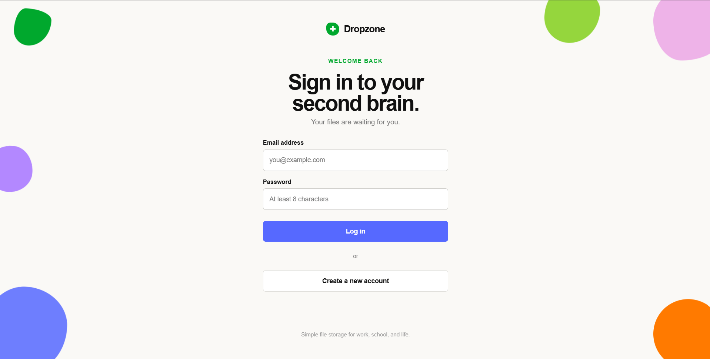
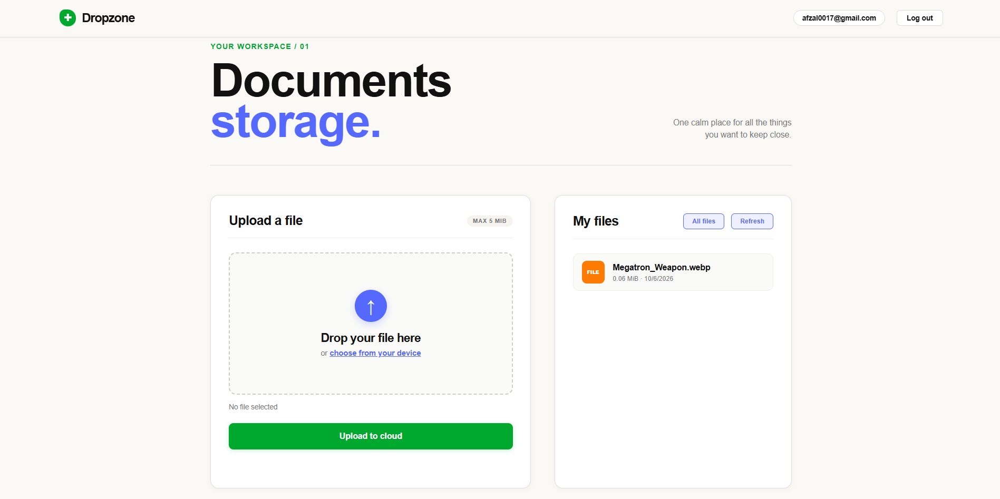

# 📁 Dropzone — Cloud File Storage & Management

[](https://nodejs.org/)
[](https://expressjs.com/)
[](https://www.mongodb.com/)
[](https://cloudinary.com/)
[](LICENSE)

**Dropzone** is a modern, lightweight cloud file storage and management web application. It features secure user authentication, role-based file access, zero-disk buffer streaming to Cloudinary CDN, and an intuitive, responsive user interface with drag-and-drop file uploads.

---

## 📸 Screenshots

### 🔐 Login & Authentication
The redesigned authentication screen features a centered form, clean typography, floating decorative shapes, and seamless switching between sign-in and account registration.

<p align="center">
  
</p>

### 🗂️ User Dashboard
A clean, card-based workspace featuring real-time file upload with drag-and-drop, individual file cards, direct cloud links, and role-based file inspection.

<p align="center">
  
</p>

---

## ✨ Features

- **User Authentication**: Secure signup and signin using salted password hashing (`bcryptjs`) and JSON Web Tokens (`jsonwebtoken`).
- **Role-Based Access Control (RBAC)**:
  - **Standard Users**: Can upload personal documents and view their own uploaded files.
  - **Administrators**: Can audit and view files uploaded across all user accounts.
- **Direct Cloud Streaming (Zero Disk Footprint)**: Uploaded files are handled in-memory using Multer's buffer storage and piped directly to Cloudinary via upload streams.
- **Size Validation**: Built-in 5 MiB file size limit enforcement on both the client and the server.
- **Modern Responsive UI**: Built with semantic HTML5 and vanilla CSS featuring glassmorphism navbars, organic floating accents, micro-animations, and drag-and-drop zones.

---

## 🛠️ Tech Stack

| Layer | Technologies |
|---|---|
| **Runtime & Backend** | [Node.js](https://nodejs.org/), [Express.js v5](https://expressjs.com/) |
| **Database** | [MongoDB](https://www.mongodb.com/) via [Mongoose ODM](https://mongoosejs.com/) |
| **Media Cloud Storage** | [Cloudinary](https://cloudinary.com/) |
| **Authentication & Security** | [JWT (jsonwebtoken)](https://github.com/auth0/node-jsonwebtoken), [bcryptjs](https://github.com/dcodeIO/bcrypt.js) |
| **File Handling** | [Multer](https://github.com/expressjs/multer) (Memory Storage) |
| **Frontend** | Vanilla JavaScript, HTML5, Vanilla CSS |

---

## 🧠 Key Backend Concepts Explained

This project demonstrates several core backend engineering patterns:

### 1. Model-View-Controller (MVC) Architecture
The backend is structured cleanly using the MVC pattern to decouple business logic, database queries, and routing:
- **Models (`src/models/`)**: Define the data structure and schema validation (`User.js`, `File.js`) using Mongoose.
- **Controllers (`src/controllers/`)**: Encapsulate the core application logic (`authController.js`, `fileController.js`), validating inputs and managing business workflows.
- **Routes (`src/routes/`)**: Map RESTful HTTP routes to controller functions and bind middleware.
- **Views / Static Assets (`Public/`)**: Serves static HTML, CSS, and client-side JavaScript.

### 2. Stateless Authentication with JSON Web Tokens (JWT)
Instead of maintaining server-side session stores:
- Upon successful login or registration, the server issues a signed JWT (`jwt.sign`) containing the user's ID and role (`role: 'user' | 'admin'`) with a 1-day expiration.
- The client stores this token in `localStorage` and includes it in the `Authorization: Bearer <token>` header for subsequent requests.
- The `requireAuth` middleware verifies the token signature on each protected route using `jwt.verify` and injects the authenticated user into `req.user`.

```javascript
// Excerpt from src/middleware/auth.js
const payload = jwt.verify(token, process.env.JWT_SECRET);
const user = await User.findById(payload.userId).select('-password');
req.user = user;
next();
```

### 3. Cryptographic Password Hashing with Salt Rounds (`bcryptjs`)
Plaintext passwords are never stored in the database:
- During registration, passwords are subjected to 12 rounds of salting and hashing (`bcrypt.hash(password, 12)`).
- During authentication, `bcrypt.compare()` compares the plaintext input against the stored hash securely without reversing the hash, preventing timing attacks and rainbow table exploitation.

### 4. Role-Based Access Control (RBAC)
The application differentiates between standard users and privileged administrators:
- A `requireAdmin` middleware checks `req.user.role === 'admin'`.
- Normal users query only their own files (`File.find({ owner: req.user.id })`).
- Administrators can invoke `/admin/files` or pass `?all=true` to retrieve the entire repository of uploads across all registered users.

```javascript
// Excerpt from src/middleware/auth.js
function requireAdmin(req, res, next) {
    if (req.user.role !== 'admin') {
        return res.status(403).json({ message: 'Admin authorization required' });
    }
    next();
}
```

### 5. In-Memory Multipart Handling (`multer.memoryStorage()`)
Traditional upload setups often write incoming files to a temporary disk directory (e.g., `uploads/`) before uploading to cloud storage:
- Dropzone uses `multer.memoryStorage()`, which keeps the incoming multipart binary stream directly in a Node.js `Buffer` in RAM (`req.file.buffer`).
- This avoids unnecessary disk I/O, prevents storage accumulation or orphaned temp files on the server, and enables containerized environments (like Docker or serverless runtimes) to operate statelessly.

### 6. Node.js Stream Piping to Cloudinary (`upload_stream`)
Rather than saving files locally, Dropzone uses Cloudinary's streaming API:
- A writable stream is created via `cloudinary.uploader.upload_stream`.
- The in-memory buffer (`req.file.buffer`) is written to the stream, piping the file directly to Cloudinary over HTTPS.
- Once completed, Cloudinary returns an immutable CDN URL (`secure_url`) and public ID, which are saved in MongoDB.

```javascript
// Excerpt from src/controllers/fileController.js
const stream = cloudinary.uploader.upload_stream(
    { resource_type: 'auto', folder: 'fileUpload' },
    (error, response) => error ? reject(error) : resolve(response)
);
stream.end(req.file.buffer);
```

### 7. Schema Relationships & Population in Mongoose
The `File` model stores a relational reference to the `User` who uploaded it using MongoDB ObjectIds:
- Schema reference: `owner: { type: mongoose.Schema.Types.ObjectId, ref: 'User' }`.
- When files are fetched, Mongoose's `.populate('owner', 'name email')` dynamically performs a lookup to hydrate owner information without exposing sensitive fields like password hashes.

---

## 🚀 Getting Started & Setup

Follow these steps to set up and run Dropzone locally on your machine.

### Prerequisites

Ensure you have the following installed:
- [Node.js](https://nodejs.org/) (v18 or higher recommended)
- [MongoDB](https://www.mongodb.com/try/download/community) installed and running locally, or a [MongoDB Atlas](https://www.mongodb.com/atlas) connection URI
- A free [Cloudinary](https://cloudinary.com/) account (to get your Cloud Name, API Key, and API Secret)

---

### Step 1: Clone the Repository

```bash
git clone https://github.com/Gitquantumcoder/Dropzone.git
cd Dropzone
```

---

### Step 2: Install Dependencies

```bash
npm install
```

---

### Step 3: Configure Environment Variables

Create a `.env` file in the root directory by copying the sample template:

```bash
cp .env.example .env
```

Open `.env` and fill in your configuration:

```env
PORT=3000
MONGODB_URL=mongodb://localhost:27017/file_nest
JWT_SECRET=your_super_secret_jwt_key

# Cloudinary Credentials (find in your Cloudinary Dashboard)
CLOUDINARY_CLOUD_NAME=your_cloudinary_cloud_name
CLOUDINARY_API_KEY=your_cloudinary_api_key
CLOUDINARY_API_SECRET=your_cloudinary_api_secret
```

---

### Step 4: Run the Application

#### Development mode (Node watch mode):
```bash
npm run dev
```

#### Production mode:
```bash
npm start
```

You should see:
```
Server started at: port-3000
```

---

### Step 5: Access the Web App

Open your browser and navigate to:
```
http://localhost:3000
```

---

## 📖 Using the Project

1. **Sign Up / Sign In**:
   - On the login screen, click **"Create a new account"** to register with your name, email, and a password (min. 8 characters).
   - Once registered, you will be automatically logged in and redirected to your dashboard.
2. **Upload a File**:
   - Drag and drop any document or image (up to 5 MiB) into the drop zone, or click **"choose from your device"**.
   - Click **"Upload to cloud"**. The file will stream directly to Cloudinary and appear in your files list.
3. **View Uploaded Files**:
   - Click on any file item under **"My files"** to open and view the asset directly via its secure Cloudinary CDN link.
4. **Admin Capabilities**:
   - To make a user an admin, update their `role` field to `'admin'` directly in your MongoDB database:
     ```javascript
     db.users.updateOne({ email: "your-email@example.com" }, { $set: { role: "admin" } });
     ```
   - When logged in as an admin, an **"All files"** button appears on the dashboard, allowing you to view and audit all files uploaded across the entire platform.

---

## 🔌 API Endpoints Reference

### Authentication (`/auth`)

| Method | Endpoint | Access | Description |
|---|---|---|---|
| `POST` | `/auth/register` | Public | Register a new user (`name`, `email`, `password`) |
| `POST` | `/auth/login` | Public | Authenticate user and receive JWT token |
| `GET` | `/auth/me` | Protected | Fetch current authenticated user's profile |

### Files (`/`)

| Method | Endpoint | Access | Description |
|---|---|---|---|
| `POST` | `/upload` | Protected | Upload single file (`multipart/form-data`, field: `myFile`, max: 5 MiB) |
| `GET` | `/files` | Protected | Fetch user's own files (or all files if admin and `?all=true`) |
| `GET` | `/admin/files` | Admin Only | Fetch all uploaded files across all users |

---

## 📂 Project Directory Structure

```
Dropzone/
├── .env.example            # Environment variables template
├── package.json            # Project dependencies & scripts
├── server.js               # Entry point (DB connection & HTTP server)
├── screenshots/            # UI screenshots for documentation
│   ├── login.png
│   └── dashboard.png
├── Public/                 # Frontend client
│   ├── index.html          # Authentication page (Login/Register)
│   ├── dashboard.html      # Workspace & file management dashboard
│   ├── styles.css          # Shared design system & UI styling
│   ├── login.js            # Client-side authentication logic
│   └── dashboard.js        # File upload & dashboard management logic
└── src/                    # Backend architecture (MVC)
    ├── app.js              # Express app configuration & middleware
    ├── config/
    │   └── cloudinary.js   # Cloudinary SDK configuration
    ├── controllers/
    │   ├── authController.js   # Registration, login, token creation
    │   └── fileController.js   # File upload stream & query logic
    ├── middleware/
    │   ├── auth.js         # JWT verification & RBAC middleware
    │   └── multer.js       # Memory-based multipart parser
    ├── models/
    │   ├── File.js         # Mongoose schema for file metadata
    │   └── User.js         # Mongoose schema for users
    └── routes/
        ├── auth.js         # Authentication route definitions
        └── fileRoutes.js   # File upload & retrieval routes
```

---

## 📜 License

This project is licensed under the [ISC License](LICENSE).
